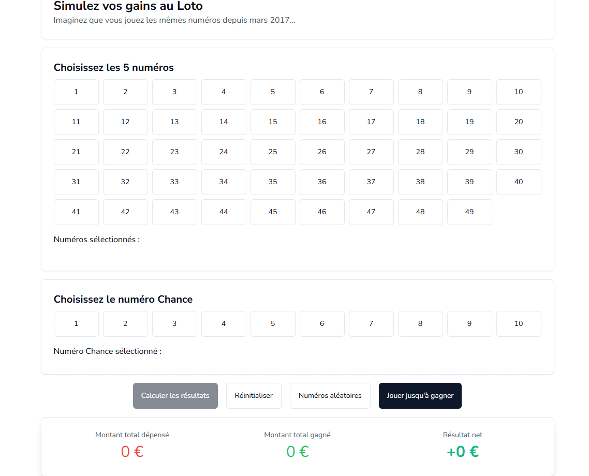

# 🎯 Simulation Loto (SvelteKit)

[](https://github.com/oliviercaron/loto_simulation/actions/workflows/update-loto-data.yml)
[](https://github.com/oliviercaron/loto_simulation/actions/workflows/deploy.yml)

**Démo :** https://oliviercaron.github.io/loto_simulation/

<p align="center">
  
</p>

Appli **SvelteKit** pour simuler des gains au **Loto 🇫🇷** : je choisis 5 numéros + 1 numéro Chance et je vois ce que ça aurait donné depuis 2017. 100 % côté client, rapide.

---

## ✨ Fonctionnalités

- Sélection de **5 numéros** + **numéro Chance**
- Boutons **“Numéros aléatoires”** et **“Jouer jusqu’à gagner”**
- Calcul sur **tous les tirages** (depuis 2017-03-06)
- **Tri** par *Date* / *Gain* (asc/desc)
- Stats : **dépensé**, **gagné**, **résultat net**
- Lit `static/data/loto_combined.csv` (séparateur `;`)
- **Prix du ticket** utilisé : **2,20 €** (modifiable)

> ⚠️ Simulation à but informatif. Non affilié à la FDJ. Aucune garantie. Jouez avec modération.

---

## 🔢 Calcul des gains (résumé)

- Chaque tirage du CSV fournit les montants `rapport_du_rang1…9`.  
- Pour une grille donnée :
  1. On compte le **nombre de bons numéros** via un **bitmask** (AND + *popcount*), puis on vérifie le **numéro Chance**.
  2. On déduit le **rang** (ex. 5+Chance → rang1, 5 sans Chance → rang2, etc.) et on prend le **montant** correspondant dans le tirage.
- **Dépensé** = `nombre_de_tirages_considerés × 2,20 €`.  
- **Résultat net** = `total_gagné − dépensé`.

> Pour changer le prix : `src/lib/stores/lotoStore.ts` → `TICKET_PRICE = 2.2`.

---

## 🧠 Données

- Fichier **unique** consommé : `static/data/loto_combined.csv` (UTF-8, `;`).
- Colonnes : `date_de_tirage`, `combinaison_gagnante_en_ordre_croissant`, `rapport_du_rang1…9`.

---

## 🚀 Démarrage

**Prérequis** : Node.js **20**

```bash
npm ci
npm run dev
# build statique + preview :
npm run build
npm run preview
```

---

## ⚙️ CI/CD

### Update des données → commit auto
`.github/workflows/update-loto-data.yml`  
- **Quand** : lun/mer/sam **20:00 UTC** (≈ 22:00 Paris été / 21:00 hiver) + manuel.  
- **Fait** : télécharge, combine via **R**, déplace vers `static/data/loto_combined.csv`, **commit si changement**.  
- **Sécurité** : `GITHUB_TOKEN`, `permissions: contents: write`, `concurrency`, `timeout`.

### Déploiement GitHub Pages
`.github/workflows/deploy.yml`  
- **Quand** : au **`workflow_run`** (après succès de l’update) et/ou sur **push** `main`.  
- **Fait** : build **Node 20** (`BASE_PATH=/loto_simulation`), upload artefact, **publish**.

**Prod** : https://oliviercaron.github.io/loto_simulation/

---

## 📂 Arborescence utile

```text
static/
  ├─ data/
  │   ├─ loto_combined.csv        # fichier consommé par l’app
  │   └─ old/                     # archives CSV (local)
  └─ demo/
      └─ simulation_loto.gif      # GIF du README

src/
  ├─ lib/
  │   ├─ components/              # UI (sélecteurs, table, cartes…)
  │   ├─ stores/
  │   │   └─ lotoStore.ts         # sélection, calculs, tri, stats (TICKET_PRICE ici)
  │   ├─ types/
  │   │   └─ lotoTypes.ts         # types TS des données
  │   └─ utils/
  │       └─ lotoUtils.ts         # bitmasks 2×32, popcount, parsing, random
  └─ routes/
      ├─ +layout.ts               # prerender = true
      ├─ +layout.svelte           # layout racine
      └─ +page.svelte             # UI principale

.github/
  └─ workflows/
      ├─ update-loto-data.yml     # maj données → static/data/loto_combined.csv
      └─ deploy.yml               # build + publication GitHub Pages

combine_script.R                  # combine les CSV → loto_combined.csv (puis déplacé)
```

---

## 🛠️ Stack

- SvelteKit + Vite
- Tailwind CSS
- d3-dsv
- @number-flow/svelte
- GitHub Actions/Pages
- R

---

## 📚 Licence & crédits

- **Code** : MIT.

---

## 🤝 Contribuer

Issues/PR bienvenues (améliorations (UI, perfs, stats))
